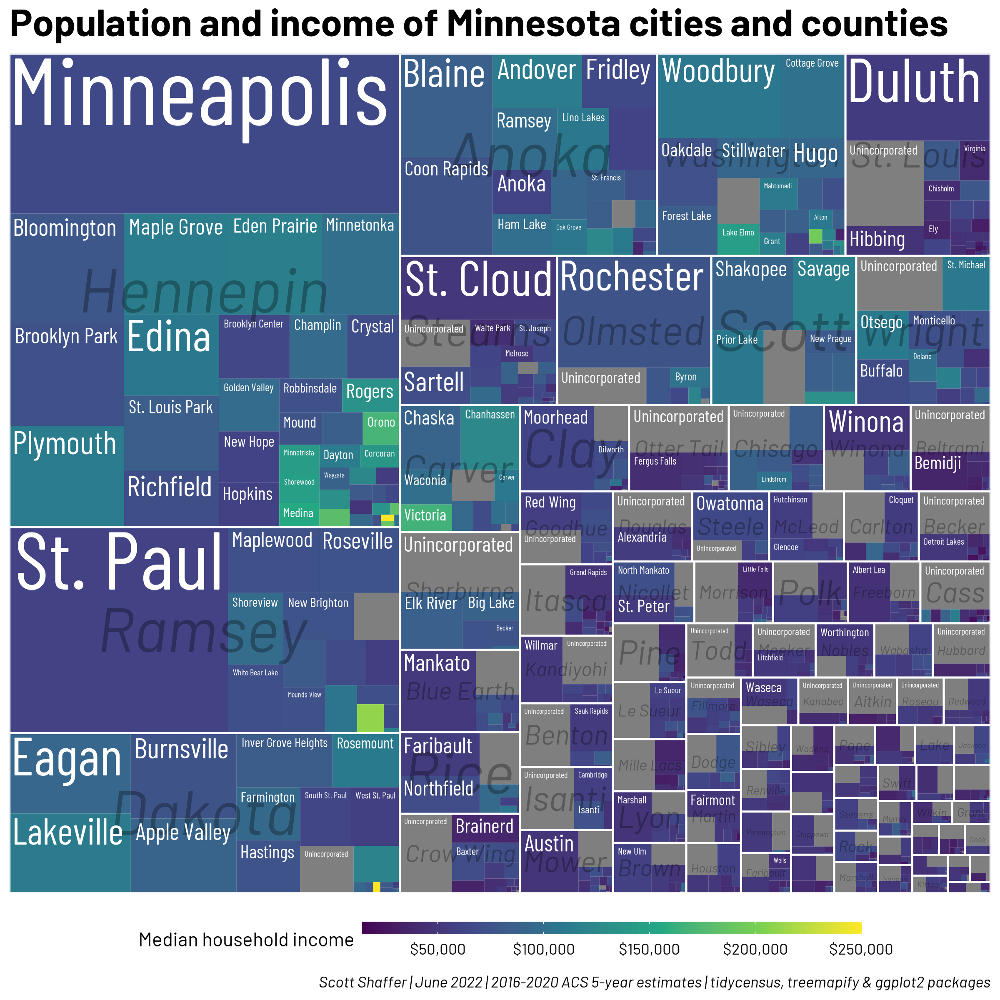

# Tree map of the population of Minnesota's counties and cities with [`treemapify`](https://cran.r-project.org/web/packages/treemapify/vignettes/introduction-to-treemapify.html) and [`tidycensus`](https://walker-data.com/tidycensus/).

This tree map is simple: each rectangle represents a jurisdiction in Minnesota, and the size of the rectangle is proportional to the jurisdiction's population. Minnesota has 87 counties, and inside most counties there are incorporated and unincorporated places. So there are 87 larger rectangles (representing the counties) which are subdivided into smaller rectangles, representing the cities and towns in each county. The color of the city and town rectangles represents the community's median household income. 

I couldn't find a Census table that broke down each county into incorporated and unincorporated places, so I had to do some calculating and joining. I made a version of this that labeled the population of each community, but I thought it was a little too busy.
```
library(tidyverse)
library(tidycensus)
library(sf)
library(treemapify)
library(janitor)
library(showtext)

#set up fonts
showtext_opts(dpi = 96)
showtext_auto(enable = TRUE)

font_add_google("Barlow Condensed", "barlow cnd")
font_add_google("Barlow", "barlow")

#get acs data for counties
mn_counties <- get_acs(geography = "county",
                       year = 2020,
                       variables = "B01003_001",
                       state = "MN",
                       geometry = TRUE) %>% 
  mutate(countypop = estimate)

#get acs data for census-designated places, join with counties
mn_places <- get_acs(
  geography = "place",
  year = 2020,
  variables = c("citypop" = "B01003_001", "hhinc" = "B19013_001"),
  state = "MN",
  geometry = TRUE,
  output = "wide") %>% 
  st_centroid() %>%
  st_join(mn_counties) %>%
  mutate(county = gsub(" County, Minnesota", "", NAME.y),
         city = gsub(" city, Minnesota", "", NAME.x),
         citypop = citypopE,
         cityinc = hhincE,
         countypop = estimate
  ) %>%
  as_tibble() %>% 
  select(citypop, cityinc, city, county, countypop, NAME.y)

#calculate the population in unincorporated places by county
incorporated_pop <- mn_places %>%
  group_by(NAME.y) %>%
  summarize(pop = sum(citypop)) %>%
  left_join(mn_counties, by = c("NAME.y" = "NAME")) %>%
  mutate(
    citypop = estimate - pop,
    city = "Unincorporated",
    county = gsub(" County, Minnesota", "", NAME.y),
    cityinc = NA) %>% 
  as_tibble() %>% 
  filter(citypop>0) %>% 
  select(citypop, cityinc, city, county, countypop, NAME.y)

#bind incorporated and unincorporated places by county
bind <- rbind(mn_places, incorporated_pop)

#plot it
ggplot(bind,
       aes(
         area = citypop,
         fill = cityinc,
         subgroup = county,
         label = city
       )) +
  geom_treemap(linetype = "blank", start = "topleft") +
  geom_treemap_subgroup_border(color = "white",
                               size = 1.5, start = "topleft") +
  geom_treemap_subgroup_text(color = "black",
                             alpha = .3,
                             place = "center",
                             start = "topleft",
                             family = "barlow",
                             fontface = "italic") +
  geom_treemap_text(color = "white",
                    place = "topleft",
                    grow = TRUE,
                    start = "topleft",
                    family = "barlow cnd") +
  labs(title = "Population and income of Minnesota cities and counties",
       caption = "Scott Shaffer | June 2022 | 2016-2020 ACS 5-year estimates | tidycensus, treemapify & ggplot2 packages") +
  scale_fill_viridis_c(name = "Median household income",
                       labels = scales::label_dollar()) +
  guides(fill = guide_colorbar(direction = "horizontal", barwidth = 20, barheight = .5)) +
  theme(text = element_text(family = "barlow"),
        plot.title = element_text(family = "barlow", size = rel(2), face = "bold"),
        plot.caption = element_text(face = "italic"),
        legend.position = c("bottom"))

showtext_opts(dpi = 300)
ggsave("mn_treemap.png", height = 8, width = 8, units = "in", dpi = 300)
```
---

